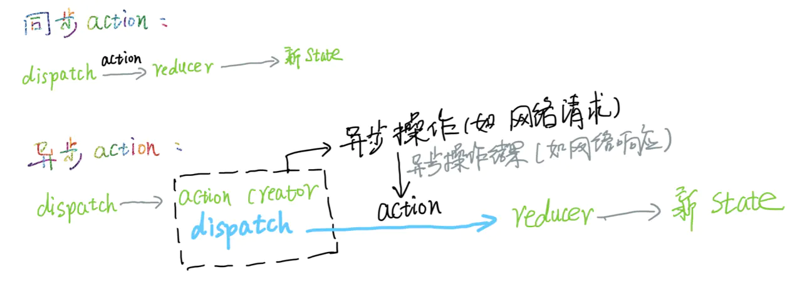
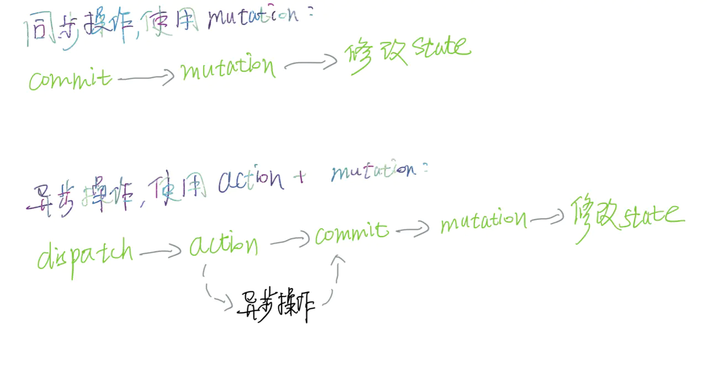

### 1.核心概念库对比

- Redux的核心概念
  - action（同步action ，或借助 中间件 实现异步操作，action 不会改变 store，只是描述了怎么改变store）
  - reducer：纯函数，根据action和旧的store计算出新的store
  - store：单一数据源
- Vuex的核心概念
  - mutation：用于同步操作、action：可用于异步操作，提交mutation
  - mutation里面直接修改state
  - state：单一数据源

- 其他：
  - Redux 提供了 store.getState() 这个 API 获取 store 树，还有 store.subscribe(listener) 订阅 store 的变化，当 store 改变时会调用监听器；Vuex 有一个 getter 的概念用于根据 state 派生出一些数据，像 Vue 的计算属性一样，当 state 改变时会重新计算出一个结果出来，提供给需要的组件。
  - 对于大型项目，当应用状态数据过于复杂，可以划分状态，这样便于管理数据流向。Redux 可以通过 combineReducers（）结合各个组件的 reducer，各个组件可以单独管理自己的状态，最后合并为一个  reducer 用于生成一个 store；Vuex 这方面用 Module 这个概念划分 store，与 Redux 一样，可以多层嵌套子状态。
  - 将状态数据绑定到视图：Redux 将状态映射到视图可以通过 React-redux 映射到 React 组件，
  - 将状态数据绑定到视图：Redux 将状态映射到视图可以通过 React-redux 映射到 React 组件，当然也可以直接使用 Redux 自己提供的 store.subscribe() 订阅 store 的改变，从而更新视图，因此 Redux 不仅仅可以用于 React，也可以用于其他框架如 Vue；而 Vuex 只能用于 Vue，它提供了 mapState、mapAction、mapMutations 等API 将 store 映射到 Vuex 各个组件，这个参考了 React-redux 的 mapStateToProps。

### 2.使用原则

- Redux的三大原则：
  - 1.单一数据源：一个Redux应用只有一个store，也是单向数据流
  - 2.state只读，（唯一改变 state 的方法就是触发 action，action 是一个用于描述已发生事件的普通对象。）
  - 3.使用纯函数（reducer）来修改state

- Vuex的三大原则：
  - 1.应用层级的状态应该集中到单个store对象中
  - 2.提交mutation是更改状态的唯一方法，并且这个过程是同步的
  - 3.异步逻辑都应该封装到action里面

### 处理异步操作

- Redux 得益于 中间件机制，利用 redux-thunk （redux-thunk 可以 dispatch 函数，这个函数用于生成 action，所以在这个函数里面我们可以进行异步操作，等异步的结果出来后再放在 action 里面将这个 action 用 dispatch 分发出去, 而这个函数被叫做 “action creator” ），可以将异步逻辑放在  action creator 里面，通过 action creator 做一个控制反转， 给 action creator 传入 dispatch 作为参数，于是就可以 dispatch  action，（原本是通过 dispatch 来分发 action ,现在是异步 action 即 action creator 掌握了控制权调用 dispatch，所以叫控制反转），Redux 并没有创造单独的概念出来专门用于异步逻辑，它是利用了 Redux 自己实现的中间件机制，中间件从 dispatch 一个异步 action 到 action 到达 reducer 之间处理 action，在这期间通过异步操作得到的结果可以放到 action 里面再通过 dispatch 分发到 reducer，以前 dispatch 一个 action 之后，这个 action 回立即到达 reducer ，所以是同步 action，现在在 action creator 里面，我们通过控制反转，可以等待异步操作结果再生成 action 分发，所以叫做异步 action：

- Vue 是用mutation来对应redux的action，另外Vuex又创造了一个action来提交mutation并通过异步提交mutation来实现异步操作结果能够达到state

